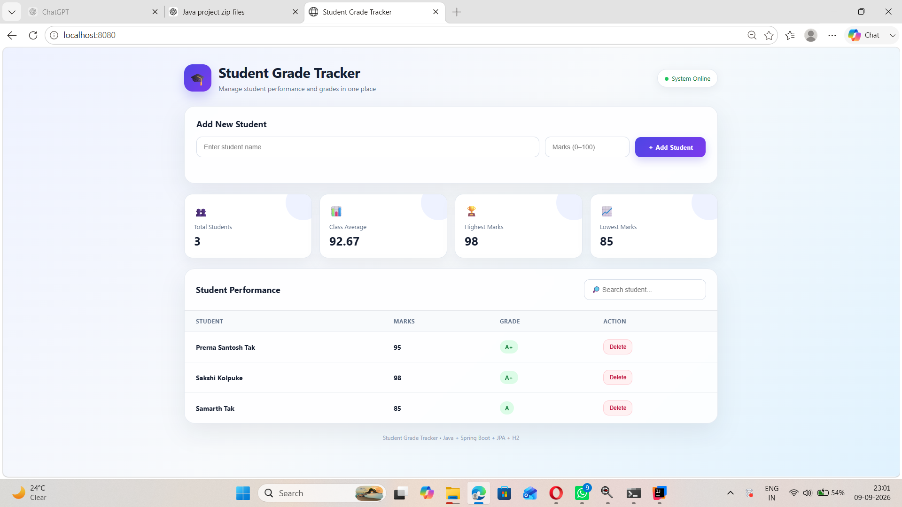

# Student Grade Tracker
Java 17 + Spring Boot + Spring Data JPA + H2.
## Run
1. Install JDK 17 and Maven.
2. Open terminal in this folder.
3. Run: mvn spring-boot:run
4. Open: http://localhost:8080
## Features
Add/delete students, average, highest/lowest marks, automatic grades, persistent H2 database.
## 📸 Project Screenshot

